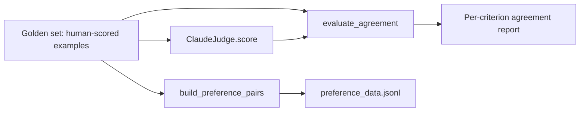

# Architecture

## Why the judge and the golden set are independent

`llm_judge.py` never imports `golden_set.py`, and `golden_set.py` never imports `llm_judge.py`. The judge scores whatever source, format, and candidate it is given; it has no idea a human already scored the same example. That independence is what makes the agreement check meaningful — if the judge's code path depended on the golden labels, agreeing with them would prove nothing.

## Why preference pairs come from the golden set, not the judge

`preference_data.py` builds pairs from `human_scores`, not from judge output. The golden set is the layer this pipeline is willing to stand behind; the judge is being validated against it, not yet trusted to generate training data on its own. Once an agreement report shows the judge matching human labels closely and consistently, swapping the judge's scores in as the source for `build_preference_pairs` is a one-line change — but that swap should be a deliberate decision made after reading the report, not the default.

## Why disagreements are listed, not just aggregated

`AgreementReport.disagreements` names the exact example and criterion where the judge and a human diverged, alongside both scores. A single aggregate number like "82% agreement" cannot tell you whether the judge is slightly noisy everywhere or reliably wrong about one specific criterion, such as always missing hallucinations. The per-example list is what turns this from a pass/fail check into something a rubric can actually be improved from.
